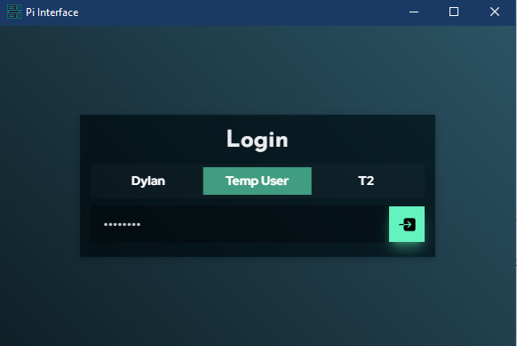
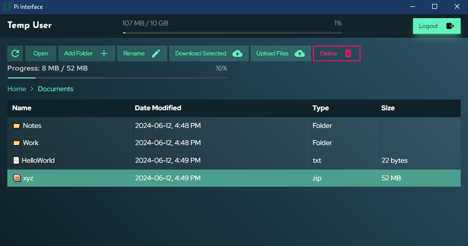

# Pi Interface

A simple desktop application that allows a set of users to access a dedicated folder on a Raspberry Pi through SSH. Currently supports:
- File Uploading
- Downloading
- Adding New Folders
- Deleting Files
- Renaming Files
- Opening and editing text files
- Simple notification system

Folders can be opened by either double clicking or using the Open button.
Navigation is done using the nav-links above the files.

Users are given a password and username to access their folder, and have a storage limit tied to their directory.
Currently the base remote directory is hardcoded as `home/user/pi-interface/user_name` which is created if it doesnt exist.

In theory, this application could be used to connect to any remote device that supports SSH and for which you have the IP address, username, and password.

## Installation

### Prerequisites

Before you begin, ensure you have the following installed:
- [Rust](https://www.rust-lang.org/tools/install)
- [Node.js](https://nodejs.org/)

### Setup

```bash
  git clone https://github.com/Dylan-B-D/pi-interface
  cd pi-interface
  npm install
  npm install -g @tauri-apps/cli
  npx tauri dev
```

## Screenshots

### Login



### File Explorer

